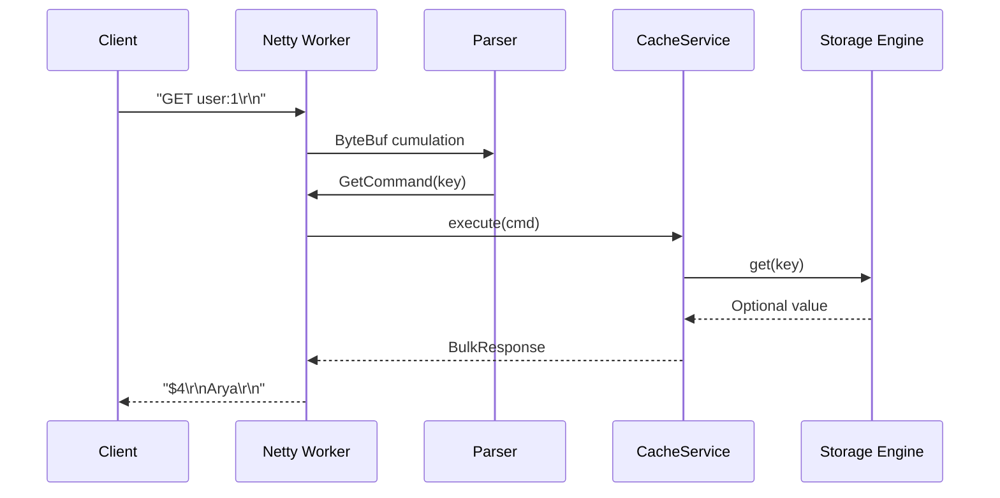

# Helix TCP Protocol

Text-based, line-oriented protocol over raw TCP. Designed for clarity in demos (`telnet`) and low parsing overhead on the server.

---

## 1. Design principles

1. **Human-readable** — Recruiters can `telnet localhost 6379` and understand immediately.
2. **Minimal parser** — No JSON, no HTTP headers; split on spaces with bulk-string rules where needed.
3. **RESP-inspired replies** — Familiar `+`, `-`, `$`, `:` prefixes without claiming Redis compatibility.
4. **Fail fast** — Malformed commands return `-ERR` and keep connection open (configurable strict mode).

---

## 2. Connection lifecycle

```
Client                    Server (Netty)
  │── TCP SYN ──────────────►│
  │◄── SYN-ACK ──────────────│
  │── ACK ───────────────────►│
  │                          │ ChannelRegistered
  │◄── optional banner ──────│  "# Helix 0.1.0\r\n" (config)
  │── command lines ─────────►│
  │◄── framed responses ─────│
  │── QUIT or close ─────────►│
  │                          │ channelInactive → cleanup
```

- **One command per line** (Phase 1–3), terminated by `\r\n` or `\n`.
- **Pipelining** (Phase 4+): client may send multiple lines before reading responses; server replies in order.
- **Max line length:** default 64 KiB (config `helix.max-command-bytes`).

---

## 3. Command grammar

Tokens are space-separated. Keys and values are UTF-8 unless `SET` uses binary mode (future).

### Commands

| Command | Syntax | Description |
|---------|--------|-------------|
| SET | `SET key value [EX seconds]` | Store value; optional TTL |
| GET | `GET key` | Return value or nil |
| DELETE | `DELETE key` | Remove key (alias: `DEL`) |
| EXISTS | `EXISTS key` | Return 1 or 0 |
| EXPIRE | `EXPIRE key seconds` | Set TTL on existing key |
| TTL | `TTL key` | Seconds remaining, -1 no TTL, -2 missing |
| PING | `PING` | Health check |
| INFO | `INFO [section]` | Server stats (Phase 4) |
| QUIT | `QUIT` | Close connection gracefully |

### Examples

```
SET user:1 Arya
GET user:1
SET session:xyz mytoken EX 300
EXPIRE user:1 60
TTL user:1
DELETE user:1
EXISTS user:1
```

---

## 4. Response types

| Prefix | Name | Example |
|--------|------|---------|
| `+` | Simple string | `+OK\r\n` |
| `-` | Error | `-ERR unknown command 'FOO'\r\n` |
| `$` | Bulk string | `$4\r\nArya\r\n` or `$-1\r\n` (nil) |
| `:` | Integer | `:1\r\n`, `:-2\r\n` |

### Command-specific responses

| Command | Success |
|---------|---------|
| SET | `+OK` |
| GET (hit) | `$<len>\r\n<bytes>\r\n` |
| GET (miss/expired) | `$-1` (nil) |
| DELETE | `:` count removed (0 or 1) |
| EXISTS | `:1` or `:0` |
| EXPIRE | `:1` set, `:0` key missing |
| TTL | `:n`, `:-1`, `:-2` |
| PING | `+PONG` |

---

## 5. Error codes (stable strings)

```
-ERR syntax error
-ERR unknown command
-ERR key too long
-ERR value too large
-ERR OOM maxmemory reached
-ERR server busy
```

Clients should parse the `-ERR` prefix, not numeric codes (Phase 1).

---

## 6. Parser implementation sketch

```java
// helix-network: HelixCommandDecoder (extends ByteToMessageDecoder)
// 1. IndexOf \n in cumulation buffer
// 2. UTF-8 decode line (max length check)
// 3. Tokenize (respect EX flag on SET)
// 4. Emit ParsedCommand record to next handler
```

**Edge cases:**

- Trailing `\r` stripped
- Empty lines ignored
- `SET` with spaces in value: Phase 1 = value is **third token only**; Phase 2+ optional quoted strings or bulk protocol

For interview demos, document: *"Production would add bulk SET like RESP; Helix Phase 1 uses single-token values for parser simplicity."*

---

## 7. Protocol vs Redis

| Aspect | Helix | Redis |
|--------|-------|-------|
| Compatibility | No | — |
| Framing | Subset similar | Full RESP3 |
| Goal | Teachable + fast parser | Ecosystem |

---

## 8. Security considerations

- Rate-limit commands per connection (later)
- Close on repeated parse errors (optional)
- Never log full values in production logs

---

## 9. Request handling flow (diagram)



---

*Implementation: `helix-network` module, Phase 1.*
